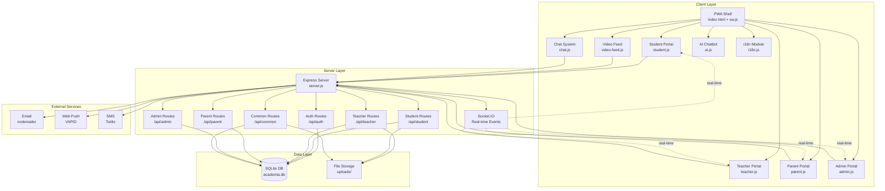
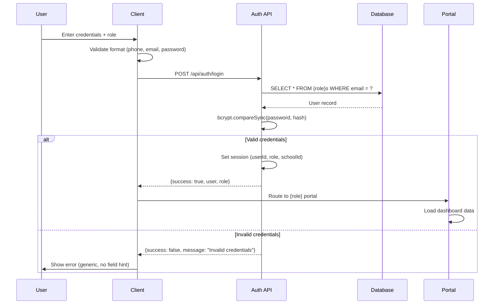
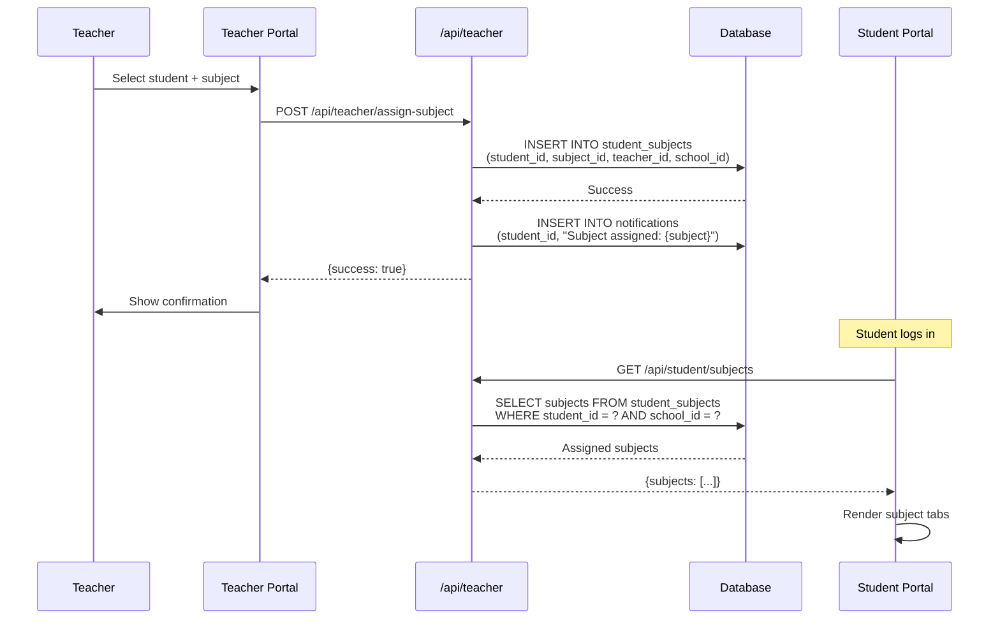
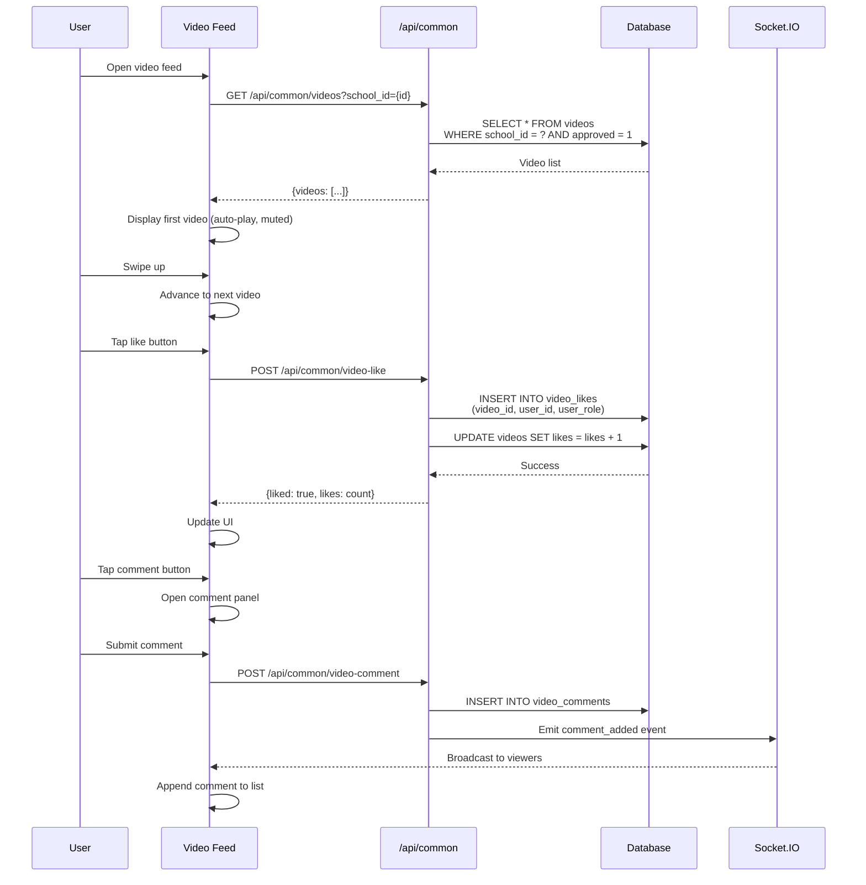
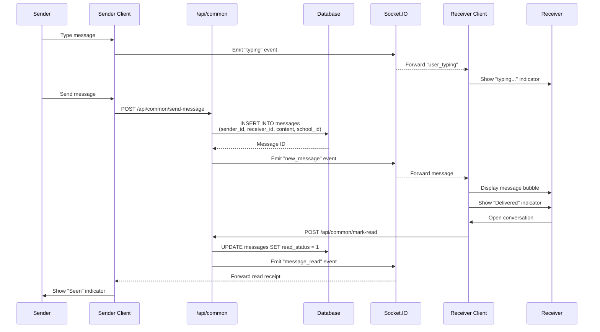

# Design Document — Academia Connect V2

## Overview

Academia Connect V2 is a major enhancement to the existing Academia Connect PWA, transforming it into a comprehensive educational platform with enterprise-grade features. Building on the existing Node.js/Express + SQLite (better-sqlite3) + Socket.IO + vanilla JS architecture, V2 introduces critical bug fixes, deep portal enhancements, a TikTok-style vertical video feed, Telegram-style real-time messaging, expanded gamification, school-isolation architecture, and multi-language support (English + Amharic).

The design maintains backward compatibility with the existing V1 codebase while introducing new subsystems: enhanced validation, subject assignment workflow, per-subject notebooks, soft-copy materials, motivational content delivery, focus mode, rewards marketplace, live video sessions, parent group chat, teacher attendance tracking, and comprehensive school isolation.

Key architectural principles:
- **School Isolation First**: All queries filtered by school_id to ensure complete data separation
- **Progressive Enhancement**: New features layer on top of existing infrastructure without breaking changes
- **Real-Time by Default**: Socket.IO for all interactive features (chat, typing indicators, notifications)
- **Offline-Capable**: Service worker caching for core functionality and content
- **Mobile-First**: Touch-optimized UI with swipe gestures for video feed and navigation

---

## Architecture

The system extends the existing MVC-adjacent monolith with new subsystems:



### New Subsystems in V2

1. **Subject Assignment System**: Teacher-driven subject assignment replacing student self-selection
2. **Video Feed Engine**: TikTok-style vertical video player with swipe navigation, auto-play, like/comment/share
3. **Enhanced Chat System**: Telegram-style messaging with seen/delivered/typing indicators, media attachments, emoji, pin/star/reply, search
4. **Notebook System**: Per-subject rich-text note editor with offline support
5. **Materials Distribution**: Teacher upload and student download of PDF/DOC/image materials per subject
6. **Motivational Content**: Dedicated video section for teacher/admin-sent motivational content
7. **Career Interest Tracking**: Student career path selection with filtered challenge content
8. **Focus Mode**: Distraction-free study interface with UI suppression
9. **Rewards Marketplace**: Point redemption for game time, movie time, avatars, badges
10. **Live Session System**: Teacher-initiated live video sessions with student invitations
11. **Parent Group Chat**: Grade-level parent communication channels
12. **Teacher Attendance**: Admin tracking of teacher presence
13. **School Isolation Layer**: Middleware ensuring complete school_id-based data separation
14. **Multi-Language System**: i18n with English and Amharic translations

---

## Main Algorithm/Workflow

### User Authentication and Portal Routing



### Subject Assignment Workflow (New in V2)



### Video Feed Interaction (New in V2)



### Telegram-Style Chat Message Flow (New in V2)



---

## Core Interfaces/Types

### Enhanced Student Model

```typescript
interface Student {
  id: number;
  full_name: string;
  nickname: string | null;
  gender: string;
  email: string;
  phone: string;
  password: string; // bcrypt hash
  school_id: number;
  grade: string;
  section: string;
  parent_name: string;
  parent_contact: string;
  avatar: string; // Default: 'scholar'
  id_photo: string | null;
  points: number; // Default: 0
  streak: number; // Default: 0
  last_study_date: string | null;
  reward_minutes: number; // Default: 0
  reward_expires: string | null; // ISO datetime
  interests: string; // JSON array of career interests
  theme: string; // Default: 'dark-academia'
  language: string; // Default: 'en'
  created_at: string;
}
```

### New: Student Subject Assignment

```typescript
interface StudentSubject {
  id: number;
  student_id: number;
  subject_id: number;
  teacher_id: number;
  school_id: number;
  assigned_at: string;
}
```

### New: Material Model

```typescript
interface Material {
  id: number;
  title: string;
  subject: string;
  file_url: string;
  file_type: string; // 'pdf' | 'doc' | 'docx' | 'image'
  description: string | null;
  uploader_id: number;
  uploader_role: string; // 'teacher' | 'admin'
  school_id: number;
  download_count: number; // Default: 0
  created_at: string;
}
```

### Enhanced Message Model (Telegram-Style)

```typescript
interface Message {
  id: number;
  sender_id: number;
  sender_role: string;
  receiver_id: number;
  receiver_role: string;
  content: string;
  media_url: string | null;
  media_type: string | null; // 'image' | 'file' | 'audio'
  read_status: number; // 0 = delivered, 1 = seen
  starred: number; // 0 | 1
  pinned: number; // 0 | 1
  reply_to: number | null; // Message ID being replied to
  school_id: number;
  created_at: string;
}
```

### New: Video Model (TikTok-Style)

```typescript
interface Video {
  id: number;
  uploader_id: number;
  uploader_role: string;
  school_id: number;
  title: string;
  description: string | null;
  file_url: string;
  thumbnail: string | null;
  likes: number; // Default: 0
  views: number; // Default: 0
  approved: number; // 0 | 1
  is_motivational: number; // 0 | 1
  created_at: string;
}

interface VideoLike {
  id: number;
  video_id: number;
  user_id: number;
  user_role: string;
}

interface VideoComment {
  id: number;
  video_id: number;
  user_id: number;
  user_role: string;
  content: string;
  created_at: string;
}
```

### New: Parent Group Model

```typescript
interface ParentGroup {
  id: number;
  school_id: number;
  grade: string;
  name: string;
  created_at: string;
}

interface GroupMessage {
  id: number;
  group_id: number;
  sender_id: number;
  sender_role: string; // 'parent' | 'teacher' | 'admin'
  content: string;
  created_at: string;
}
```

### New: Teacher Attendance Model

```typescript
interface TeacherAttendance {
  id: number;
  teacher_id: number;
  school_id: number;
  date: string; // YYYY-MM-DD
  status: string; // 'present' | 'absent' | 'late' | 'excused'
  notes: string | null;
  marked_by: number; // Admin ID
  created_at: string;
}
```

### New: Live Session Model

```typescript
interface LiveSession {
  id: number;
  teacher_id: number;
  school_id: number;
  title: string;
  subject: string;
  meeting_url: string;
  start_time: string;
  duration: number; // minutes
  invited_students: string; // JSON array of student IDs
  status: string; // 'scheduled' | 'live' | 'ended'
  created_at: string;
}
```

### New: Reward Redemption Model

```typescript
interface RewardRedemption {
  id: number;
  student_id: number;
  reward_type: string; // 'game_time' | 'movie_time' | 'avatar' | 'badge'
  reward_name: string;
  points_cost: number;
  redeemed_at: string;
}
```

---

## Key Functions with Formal Specifications

### Function 1: validatePhoneNumber()

```javascript
function validatePhoneNumber(phone) {
  // Remove whitespace
  const cleaned = phone.replace(/\s/g, '');
  // Ethiopian format: +251 followed by 7 or 9, then 8 digits
  return /^\+251[79]\d{8}$/.test(cleaned);
}
```

**Preconditions:**
- `phone` is a string (may be empty or malformed)

**Postconditions:**
- Returns `true` if and only if phone matches Ethiopian mobile format: +251[7|9]XXXXXXXX
- Returns `false` for any other format
- No side effects on input parameter

**Loop Invariants:** N/A (no loops)

---

### Function 2: validateEmail()

```javascript
function validateEmail(email) {
  // Check for exactly one @ and at least one . after @
  return /^[^\s@]+@[^\s@]+\.[^\s@]+$/.test(email);
}
```

**Preconditions:**
- `email` is a string (may be empty or malformed)

**Postconditions:**
- Returns `true` if and only if email contains exactly one "@" and at least one "." after "@"
- Returns `false` for any other format
- No side effects on input parameter

**Loop Invariants:** N/A (no loops)

---

### Function 3: checkPasswordStrength()

```javascript
function checkPasswordStrength(password) {
  if (password.length < 8) return 'weak';
  
  const hasLower = /[a-z]/.test(password);
  const hasUpper = /[A-Z]/.test(password);
  const hasDigit = /\d/.test(password);
  const hasSpecial = /[^a-zA-Z0-9]/.test(password);
  
  if (hasLower && hasUpper && hasDigit && hasSpecial) return 'strong';
  if ((hasLower || hasUpper) && hasDigit) return 'good';
  if (hasLower || hasUpper) return 'fair';
  
  return 'weak';
}
```

**Preconditions:**
- `password` is a string (may be empty)

**Postconditions:**
- Returns one of: 'weak', 'fair', 'good', 'strong'
- 'weak': length < 8 OR only digits
- 'fair': length >= 8 AND letters only
- 'good': length >= 8 AND (mixed case OR letters + digits)
- 'strong': length >= 8 AND mixed case AND digits AND special character
- No side effects on input parameter

**Loop Invariants:** N/A (no loops)

---

### Function 4: enforceSchoolIsolation()

```javascript
function enforceSchoolIsolation(req, res, next) {
  if (!req.session.schoolId) {
    return res.status(401).json({ success: false, message: 'Unauthorized' });
  }
  
  // Attach school_id to all queries
  req.schoolId = req.session.schoolId;
  next();
}
```

**Preconditions:**
- `req` is an Express request object with session middleware applied
- `req.session` exists (may or may not have schoolId)

**Postconditions:**
- If `req.session.schoolId` is undefined or null, returns HTTP 401 and stops middleware chain
- If `req.session.schoolId` exists, sets `req.schoolId` and calls `next()`
- Ensures all subsequent route handlers have access to authenticated school_id

**Loop Invariants:** N/A (no loops)

---

### Function 5: assignSubjectToStudent()

```javascript
async function assignSubjectToStudent(teacherId, studentId, subjectId, schoolId) {
  // Check if assignment already exists
  const existing = db.prepare(`
    SELECT id FROM student_subjects 
    WHERE student_id = ? AND subject_id = ? AND school_id = ?
  `).get(studentId, subjectId, schoolId);
  
  if (existing) {
    throw new Error('Subject already assigned to this student');
  }
  
  // Create assignment
  const result = db.prepare(`
    INSERT INTO student_subjects (student_id, subject_id, teacher_id, school_id)
    VALUES (?, ?, ?, ?)
  `).run(studentId, subjectId, teacherId, schoolId);
  
  // Create notification
  const subject = db.prepare('SELECT name FROM subjects WHERE id = ?').get(subjectId);
  db.prepare(`
    INSERT INTO notifications (user_id, user_role, title, body, type)
    VALUES (?, 'student', 'New Subject Assigned', ?, 'subject_assignment')
  `).run(studentId, `Your teacher has assigned you to ${subject.name}`);
  
  return result.lastInsertRowid;
}
```

**Preconditions:**
- `teacherId`, `studentId`, `subjectId`, `schoolId` are positive integers
- `studentId` exists in students table with matching `school_id`
- `subjectId` exists in subjects table with matching `school_id`
- `teacherId` exists in teachers table with matching `school_id`

**Postconditions:**
- If assignment already exists, throws Error without modifying database
- If assignment is new, creates record in student_subjects table
- Creates notification for student
- Returns the new assignment ID
- All operations are atomic (SQLite transaction)

**Loop Invariants:** N/A (no loops)

---

### Function 6: calculateStreakUpdate()

```javascript
function calculateStreakUpdate(lastStudyDate, currentDate) {
  if (!lastStudyDate) return { streak: 1, shouldUpdate: true };
  
  const last = new Date(lastStudyDate);
  const current = new Date(currentDate);
  
  // Reset time to midnight for date comparison
  last.setHours(0, 0, 0, 0);
  current.setHours(0, 0, 0, 0);
  
  const daysDiff = Math.floor((current - last) / (1000 * 60 * 60 * 24));
  
  if (daysDiff === 0) {
    // Same day, no update
    return { streak: null, shouldUpdate: false };
  } else if (daysDiff === 1) {
    // Consecutive day, increment streak
    return { streak: 'increment', shouldUpdate: true };
  } else {
    // Gap > 1 day, reset streak
    return { streak: 1, shouldUpdate: true };
  }
}
```

**Preconditions:**
- `lastStudyDate` is either null or a valid ISO date string
- `currentDate` is a valid ISO date string

**Postconditions:**
- Returns object with `streak` and `shouldUpdate` properties
- If `lastStudyDate` is null, returns `{streak: 1, shouldUpdate: true}`
- If same calendar day, returns `{streak: null, shouldUpdate: false}`
- If consecutive day (daysDiff === 1), returns `{streak: 'increment', shouldUpdate: true}`
- If gap > 1 day, returns `{streak: 1, shouldUpdate: true}`
- No side effects on input parameters

**Loop Invariants:** N/A (no loops)

---

### Function 7: processVideoLike()

```javascript
async function processVideoLike(videoId, userId, userRole, schoolId) {
  // Check if already liked
  const existing = db.prepare(`
    SELECT id FROM video_likes 
    WHERE video_id = ? AND user_id = ? AND user_role = ?
  `).get(videoId, userId, userRole);
  
  if (existing) {
    // Unlike
    db.prepare('DELETE FROM video_likes WHERE id = ?').run(existing.id);
    db.prepare('UPDATE videos SET likes = likes - 1 WHERE id = ?').run(videoId);
    return { liked: false, action: 'unliked' };
  } else {
    // Like
    db.prepare(`
      INSERT INTO video_likes (video_id, user_id, user_role)
      VALUES (?, ?, ?)
    `).run(videoId, userId, userRole);
    db.prepare('UPDATE videos SET likes = likes + 1 WHERE id = ?').run(videoId);
    return { liked: true, action: 'liked' };
  }
}
```

**Preconditions:**
- `videoId`, `userId` are positive integers
- `userRole` is one of: 'student', 'teacher', 'parent', 'admin'
- `schoolId` is a positive integer
- Video with `videoId` exists and belongs to `schoolId`

**Postconditions:**
- If user has already liked the video, removes like record and decrements like count
- If user has not liked the video, creates like record and increments like count
- Returns object indicating final state: `{liked: boolean, action: string}`
- All operations are atomic (SQLite transaction)

**Loop Invariants:** N/A (no loops)

---

### Function 8: sendTelegramStyleMessage()

```javascript
async function sendTelegramStyleMessage(senderId, senderRole, receiverId, receiverRole, content, mediaUrl, mediaType, replyTo, schoolId, io) {
  // Insert message
  const result = db.prepare(`
    INSERT INTO messages (sender_id, sender_role, receiver_id, receiver_role, content, media_url, media_type, reply_to, school_id, read_status)
    VALUES (?, ?, ?, ?, ?, ?, ?, ?, ?, 0)
  `).run(senderId, senderRole, receiverId, receiverRole, content, mediaUrl, mediaType, replyTo, schoolId);
  
  const messageId = result.lastInsertRowid;
  
  // Fetch full message with reply context
  let message = db.prepare('SELECT * FROM messages WHERE id = ?').get(messageId);
  
  if (replyTo) {
    message.reply_context = db.prepare('SELECT * FROM messages WHERE id = ?').get(replyTo);
  }
  
  // Emit real-time event
  const targetKey = `${receiverId}_${receiverRole}`;
  io.to(targetKey).emit('new_message', message);
  
  // Create notification
  db.prepare(`
    INSERT INTO notifications (user_id, user_role, title, body, type)
    VALUES (?, ?, 'New Message', ?, 'message')
  `).run(receiverId, receiverRole, `New message from ${senderRole}`);
  
  return message;
}
```

**Preconditions:**
- `senderId`, `receiverId` are positive integers
- `senderRole`, `receiverRole` are valid role strings
- `content` is non-empty string
- `mediaUrl`, `mediaType`, `replyTo` may be null
- `schoolId` is a positive integer
- `io` is a Socket.IO server instance
- Both sender and receiver belong to `schoolId`

**Postconditions:**
- Creates message record with `read_status = 0` (delivered)
- If `replyTo` is provided, attaches reply context to message object
- Emits `new_message` event to receiver via Socket.IO
- Creates notification for receiver
- Returns complete message object with reply context if applicable
- All database operations are atomic

**Loop Invariants:** N/A (no loops)

---

### Function 9: redeemReward()

```javascript
async function redeemReward(studentId, rewardType, rewardName, pointsCost, schoolId) {
  // Get student's current points
  const student = db.prepare('SELECT points FROM students WHERE id = ? AND school_id = ?').get(studentId, schoolId);
  
  if (!student) {
    throw new Error('Student not found');
  }
  
  if (student.points < pointsCost) {
    throw new Error('Not enough points');
  }
  
  // Deduct points
  db.prepare('UPDATE students SET points = points - ? WHERE id = ?').run(pointsCost, studentId);
  
  // Record redemption
  db.prepare(`
    INSERT INTO reward_redemptions (student_id, reward_type, reward_name, points_cost)
    VALUES (?, ?, ?, ?)
  `).run(studentId, rewardType, rewardName, pointsCost);
  
  // Activate reward
  if (rewardType === 'game_time' || rewardType === 'movie_time') {
    const duration = 30; // minutes
    const expires = new Date(Date.now() + duration * 60 * 1000).toISOString();
    db.prepare('UPDATE students SET reward_minutes = ?, reward_expires = ? WHERE id = ?').run(duration, expires, studentId);
  } else if (rewardType === 'avatar') {
    db.prepare('UPDATE students SET avatar = ? WHERE id = ?').run(rewardName, studentId);
  } else if (rewardType === 'badge') {
    db.prepare(`
      INSERT INTO badges (student_id, badge_type, badge_name)
      VALUES (?, 'reward', ?)
    `).run(studentId, rewardName);
  }
  
  return { success: true, remainingPoints: student.points - pointsCost };
}
```

**Preconditions:**
- `studentId`, `schoolId` are positive integers
- `rewardType` is one of: 'game_time', 'movie_time', 'avatar', 'badge'
- `rewardName` is a non-empty string
- `pointsCost` is a positive integer
- Student with `studentId` exists and belongs to `schoolId`

**Postconditions:**
- If student has insufficient points, throws Error without modifying database
- If student has sufficient points, deducts points from student record
- Creates redemption record
- Activates reward based on type:
  - game_time/movie_time: Sets reward_minutes and reward_expires
  - avatar: Updates student avatar
  - badge: Creates badge record
- Returns object with success flag and remaining points
- All operations are atomic (SQLite transaction)

**Loop Invariants:** N/A (no loops)

---

### Function 10: generateWeeklyParentReport()

```javascript
async function generateWeeklyParentReport(studentId, schoolId) {
  const weekStart = new Date();
  weekStart.setDate(weekStart.getDate() - 7);
  const weekStartStr = weekStart.toISOString().split('T')[0];
  
  // Fetch tasks completed this week
  const tasksCompleted = db.prepare(`
    SELECT COUNT(*) as count FROM tasks 
    WHERE student_id = ? AND completed = 1 AND created_at >= ?
  `).get(studentId, weekStartStr).count;
  
  // Fetch total study time this week
  const studyTime = db.prepare(`
    SELECT SUM(duration) as total FROM study_sessions 
    WHERE student_id = ? AND date >= ?
  `).get(studentId, weekStartStr).total || 0;
  
  // Fetch current streak
  const student = db.prepare('SELECT streak FROM students WHERE id = ?').get(studentId);
  
  // Fetch recent assessments
  const assessments = db.prepare(`
    SELECT subject, percentage, grade FROM assessments 
    WHERE student_id = ? AND date >= ?
    ORDER BY date DESC
  `).all(studentId, weekStartStr);
  
  // Fetch badges earned this week
  const badges = db.prepare(`
    SELECT badge_name FROM badges 
    WHERE student_id = ? AND earned_at >= ?
  `).all(studentId, weekStartStr);
  
  return {
    tasksCompleted,
    studyTime,
    streak: student.streak,
    assessments,
    badges
  };
}
```

**Preconditions:**
- `studentId`, `schoolId` are positive integers
- Student with `studentId` exists and belongs to `schoolId`
- Database tables (tasks, study_sessions, students, assessments, badges) exist and are accessible

**Postconditions:**
- Returns object containing:
  - `tasksCompleted`: Count of completed tasks in past 7 days
  - `studyTime`: Total study minutes in past 7 days
  - `streak`: Current streak count
  - `assessments`: Array of recent assessment results
  - `badges`: Array of badges earned in past 7 days
- No side effects on database
- All queries filtered by student_id and date range

**Loop Invariants:** N/A (no explicit loops; SQL aggregations handled by database)

---

## Algorithmic Pseudocode

### Main Processing Algorithm: Task Completion with Rewards

```javascript
ALGORITHM completeTaskWithRewards(taskId, studentId, schoolId)
INPUT: taskId (integer), studentId (integer), schoolId (integer)
OUTPUT: result object with points awarded and reward time unlocked

BEGIN
  ASSERT taskId > 0 AND studentId > 0 AND schoolId > 0
  
  // Step 1: Verify task ownership and school isolation
  task ← db.query("SELECT * FROM tasks WHERE id = ? AND student_id = ? AND school_id = ?", 
                   taskId, studentId, schoolId)
  
  IF task IS NULL THEN
    THROW Error("Task not found or access denied")
  END IF
  
  IF task.completed = 1 THEN
    THROW Error("Task already completed")
  END IF
  
  // Step 2: Mark task as complete
  db.execute("UPDATE tasks SET completed = 1 WHERE id = ?", taskId)
  
  // Step 3: Award points
  pointsAwarded ← 10
  db.execute("UPDATE students SET points = points + ? WHERE id = ?", 
             pointsAwarded, studentId)
  
  // Step 4: Unlock reward time
  rewardMinutes ← 30
  rewardExpires ← currentTime + (rewardMinutes * 60 * 1000)
  db.execute("UPDATE students SET reward_minutes = ?, reward_expires = ? WHERE id = ?",
             rewardMinutes, rewardExpires, studentId)
  
  // Step 5: Update streak
  student ← db.query("SELECT last_study_date, streak FROM students WHERE id = ?", studentId)
  streakUpdate ← calculateStreakUpdate(student.last_study_date, currentDate)
  
  IF streakUpdate.shouldUpdate THEN
    IF streakUpdate.streak = 'increment' THEN
      newStreak ← student.streak + 1
    ELSE
      newStreak ← streakUpdate.streak
    END IF
    
    db.execute("UPDATE students SET streak = ?, last_study_date = ? WHERE id = ?",
               newStreak, currentDate, studentId)
    
    // Award streak badges
    IF newStreak = 5 THEN
      db.execute("INSERT INTO badges (student_id, badge_type, badge_name) VALUES (?, 'streak', '5-Day Streak')",
                 studentId)
    ELSE IF newStreak = 30 THEN
      db.execute("INSERT INTO badges (student_id, badge_type, badge_name) VALUES (?, 'streak', '30-Day Scholar')",
                 studentId)
    END IF
  END IF
  
  // Step 6: Create notification
  db.execute("INSERT INTO notifications (user_id, user_role, title, body, type) VALUES (?, 'student', 'Task Completed!', 'You earned 10 points and 30 minutes of reward time', 'task_completion')",
             studentId)
  
  RETURN {
    success: true,
    pointsAwarded: pointsAwarded,
    rewardMinutes: rewardMinutes,
    rewardExpires: rewardExpires,
    streak: newStreak
  }
END
```

**Preconditions:**
- taskId, studentId, schoolId are positive integers
- Task with taskId exists and belongs to studentId and schoolId
- Student with studentId exists and belongs to schoolId

**Postconditions:**
- Task is marked as completed
- Student points increased by 10
- Student reward_minutes set to 30, reward_expires set to current time + 30 minutes
- Student streak updated based on last_study_date
- Streak badges awarded if thresholds reached (5 days, 30 days)
- Notification created for student
- Returns result object with awarded points and reward details

**Loop Invariants:** N/A (no loops)

---

### Validation Algorithm: Registration Input Validation

```javascript
ALGORITHM validateRegistrationInput(payload)
INPUT: payload (object with registration fields)
OUTPUT: validationResult object with isValid flag and errors array

BEGIN
  errors ← []
  
  // Check required fields
  requiredFields ← ['role', 'full_name', 'email', 'phone', 'password', 'school_name']
  FOR EACH field IN requiredFields DO
    IF payload[field] IS NULL OR payload[field] IS EMPTY THEN
      errors.push(field + " is required")
    END IF
  END FOR
  
  // Validate role
  validRoles ← ['student', 'teacher', 'parent', 'admin']
  IF payload.role NOT IN validRoles THEN
    errors.push("Invalid role. Must be student, teacher, parent, or admin")
  END IF
  
  // Validate email format
  IF payload.email IS NOT EMPTY THEN
    IF NOT validateEmail(payload.email) THEN
      errors.push("Invalid email format. Email must contain @ and .")
    END IF
  END IF
  
  // Validate phone format
  IF payload.phone IS NOT EMPTY THEN
    IF NOT validatePhoneNumber(payload.phone) THEN
      errors.push("Invalid phone. Use Ethiopian format: +251XXXXXXXXX")
    END IF
  END IF
  
  // Validate password strength
  IF payload.password IS NOT EMPTY THEN
    IF payload.password.length < 8 THEN
      errors.push("Password must be at least 8 characters")
    END IF
    
    IF payload.confirm_password IS DEFINED AND payload.password ≠ payload.confirm_password THEN
      errors.push("Passwords do not match")
    END IF
  END IF
  
  // Role-specific validation
  IF payload.role = 'teacher' THEN
    IF payload.employee_id IS NULL OR payload.employee_id IS EMPTY THEN
      errors.push("employee_id is required for teacher registration")
    END IF
  END IF
  
  // Check for duplicate email
  FOR EACH table IN ['students', 'teachers', 'parents', 'admins'] DO
    existing ← db.query("SELECT id FROM " + table + " WHERE email = ?", payload.email)
    IF existing IS NOT NULL THEN
      errors.push("Email already registered")
      BREAK
    END IF
  END FOR
  
  // Check for duplicate employee_id (teachers only)
  IF payload.role = 'teacher' AND payload.employee_id IS NOT EMPTY THEN
    existing ← db.query("SELECT id FROM teachers WHERE employee_id = ?", payload.employee_id)
    IF existing IS NOT NULL THEN
      errors.push("Employee ID already exists")
    END IF
  END IF
  
  RETURN {
    isValid: errors.length = 0,
    errors: errors
  }
END
```

**Preconditions:**
- payload is an object (may contain any fields or be empty)
- Database connection is available

**Postconditions:**
- Returns object with `isValid` boolean and `errors` array
- `isValid` is true if and only if all validations pass
- `errors` contains descriptive error messages for each failed validation
- No side effects on database or payload

**Loop Invariants:**
- All previously checked required fields were either present or added to errors
- All previously checked format validations either passed or added to errors
- All previously checked database uniqueness constraints either passed or added to errors

---

## API Endpoints

### Authentication Endpoints (Enhanced)

| Method | Path | Description | Request Body | Response |
|--------|------|-------------|--------------|----------|
| POST | `/api/auth/register` | Multi-role registration with enhanced validation | `{role, full_name, email, phone, password, confirm_password, school_name, ...roleSpecificFields}` | `{success, message, userId, role}` |
| POST | `/api/auth/login` | Role-based login with employee_id for teachers | `{email, password, role, employee_id?}` | `{success, user, role}` |
| POST | `/api/auth/logout` | Destroy session | - | `{success}` |
| GET | `/api/auth/me` | Get current session user | - | `{success, user, role}` |
| POST | `/api/auth/forgot-password` | Send password reset email | `{email}` | `{success, message}` |
| POST | `/api/auth/reset-password` | Reset password with token | `{token, password}` | `{success, message}` |
| GET | `/api/auth/schools` | List all schools | - | `{success, schools}` |

---

### Student Endpoints (Enhanced)

| Method | Path | Description | Request Body | Response |
|--------|------|-------------|--------------|----------|
| GET | `/api/student/dashboard` | Dashboard data (student, tasks, assessments, badges, notifications, announcements) | - | `{success, student, tasks, assessments, badges, notifications, announcements}` |
| GET | `/api/student/subjects` | Get assigned subjects | - | `{success, subjects}` |
| GET/POST | `/api/student/tasks` | List / create tasks | POST: `{title, subject, due_date, due_time, priority, notes, recurring}` | `{success, tasks}` / `{success, task}` |
| PUT | `/api/student/tasks/:id` | Update task (including completion) | `{title?, subject?, due_date?, due_time?, priority?, notes?, recurring?, completed?}` | `{success, task, pointsAwarded?, rewardMinutes?}` |
| DELETE | `/api/student/tasks/:id` | Delete task | - | `{success}` |
| GET | `/api/student/results` | Assessment results grouped by subject | - | `{success, results, subjectAverages}` |
| GET | `/api/student/attendance` | Attendance records | - | `{success, attendance}` |
| GET | `/api/student/notes` | List notes (all or by subject) | Query: `?subject={subject}` | `{success, notes}` |
| POST | `/api/student/notes` | Create note | `{title, subject, content}` | `{success, note}` |
| PUT | `/api/student/notes/:id` | Update note | `{title?, content?}` | `{success, note}` |
| DELETE | `/api/student/notes/:id` | Delete note | - | `{success}` |
| GET | `/api/student/materials` | Get materials for assigned subjects | - | `{success, materials}` |
| GET | `/api/student/videos` | School videos (non-motivational) | - | `{success, videos}` |
| GET | `/api/student/motivational-videos` | Motivational videos | - | `{success, videos}` |
| POST | `/api/student/video-view` | Mark video as viewed | `{videoId}` | `{success}` |
| GET | `/api/student/quizzes` | Available quizzes | - | `{success, quizzes}` |
| POST | `/api/student/quiz-attempt` | Submit quiz answers | `{quizId, answers}` | `{success, score, total, rewardMinutes}` |
| GET | `/api/student/leaderboard` | School leaderboard | - | `{success, leaderboard, myRank}` |
| GET | `/api/student/challenges` | Interest-based challenges | - | `{success, challenges}` |
| POST | `/api/student/challenge-progress` | Update challenge progress | `{interest, level, xp, completedLessons}` | `{success}` |
| GET | `/api/student/portfolio` | Portfolio items | - | `{success, portfolio}` |
| POST | `/api/student/portfolio` | Add portfolio item | `{title, description, file, type}` | `{success, item}` |
| DELETE | `/api/student/portfolio/:id` | Delete portfolio item | - | `{success}` |
| POST | `/api/student/study-session` | Record study session | `{subject, duration}` | `{success}` |
| GET | `/api/student/analytics` | Weekly analytics | - | `{success, tasksChart, completionRate, studyTime, streak}` |
| GET | `/api/student/rewards` | Available rewards | - | `{success, rewards, points}` |
| POST | `/api/student/redeem-reward` | Redeem reward | `{rewardType, rewardName, pointsCost}` | `{success, remainingPoints}` |
| GET | `/api/student/reward-history` | Redemption history | - | `{success, history}` |
| PUT | `/api/student/profile` | Update profile (name, avatar, theme, language, interests) | `{nickname?, avatar?, theme?, language?, interests?}` | `{success, student}` |
| POST | `/api/student/send-kudos` | Send kudos to classmate | `{toStudentId, message}` | `{success}` |

---

### Teacher Endpoints (Enhanced)

| Method | Path | Description | Request Body | Response |
|--------|------|-------------|--------------|----------|
| GET | `/api/teacher/dashboard` | Dashboard data | - | `{success, teacher, students, classes, announcements}` |
| GET | `/api/teacher/students` | Students in teacher's school | Query: `?grade={grade}&section={section}` | `{success, students}` |
| POST | `/api/teacher/assign-subject` | Assign subject to student | `{studentId, subjectId}` | `{success}` |
| DELETE | `/api/teacher/assign-subject` | Remove subject assignment | `{studentId, subjectId}` | `{success}` |
| GET | `/api/teacher/student-subjects/:studentId` | Get student's assigned subjects | - | `{success, subjects}` |
| POST | `/api/teacher/assessment` | Create assessment | `{studentId, subject, assessmentType, date, maxMarks, marksObtained, comments, topics, sendToParent}` | `{success, assessment}` |
| GET | `/api/teacher/assessments/:studentId` | Student's assessments | - | `{success, assessments}` |
| POST | `/api/teacher/attendance` | Bulk attendance save | `{date, records: [{studentId, status, notes}]}` | `{success}` |
| GET | `/api/teacher/attendance` | Get attendance records | Query: `?date={date}&grade={grade}&section={section}` | `{success, attendance}` |
| GET | `/api/teacher/subjects` | Teacher's subjects | - | `{success, subjects}` |
| POST | `/api/teacher/subjects` | Add subject | `{name}` | `{success, subject}` |
| GET | `/api/teacher/materials` | Uploaded materials | - | `{success, materials}` |
| POST | `/api/teacher/materials` | Upload material | FormData: `{title, subject, file, description?}` | `{success, material}` |
| DELETE | `/api/teacher/materials/:id` | Delete material | - | `{success}` |
| GET | `/api/teacher/quizzes` | Created quizzes | - | `{success, quizzes}` |
| POST | `/api/teacher/quizzes` | Create quiz | `{title, subject, timeLimit, rewardMinutes, questions: [{text, options, correctIndex}]}` | `{success, quiz}` |
| DELETE | `/api/teacher/quizzes/:id` | Delete quiz | - | `{success}` |
| GET | `/api/teacher/quiz-attempts/:quizId` | Quiz attempts | - | `{success, attempts}` |
| GET | `/api/teacher/videos` | Uploaded videos | - | `{success, videos}` |
| POST | `/api/teacher/videos` | Upload video | FormData: `{title, description, file, isMotivational}` | `{success, video}` |
| DELETE | `/api/teacher/videos/:id` | Delete video | - | `{success}` |
| GET | `/api/teacher/competitions` | Created competitions | - | `{success, competitions}` |
| POST | `/api/teacher/competitions` | Create competition | `{title, description, subject, startDate, endDate, rewardPoints}` | `{success, competition}` |
| DELETE | `/api/teacher/competitions/:id` | Delete competition | - | `{success}` |
| GET | `/api/teacher/announcements` | Teacher's announcements | - | `{success, announcements}` |
| POST | `/api/teacher/announcements` | Create announcement | `{title, content, targetRoles}` | `{success, announcement}` |
| GET | `/api/teacher/events` | School events | - | `{success, events}` |
| POST | `/api/teacher/events` | Create event | `{title, description, eventDate, eventType}` | `{success, event}` |
| POST | `/api/teacher/live-session` | Create live session | `{title, subject, meetingUrl, startTime, duration, invitedStudents}` | `{success, session}` |
| GET | `/api/teacher/live-sessions` | Teacher's live sessions | - | `{success, sessions}` |
| PUT | `/api/teacher/live-session/:id/status` | Update session status | `{status}` | `{success}` |
| POST | `/api/teacher/weekly-report` | Send weekly report to parent | `{studentId}` | `{success}` |
| GET | `/api/teacher/messages` | Message threads | - | `{success, threads}` |
| POST | `/api/teacher/messages` | Send message | `{receiverId, receiverRole, content, mediaUrl?, mediaType?, replyTo?}` | `{success, message}` |

---

### Parent Endpoints (Enhanced)

| Method | Path | Description | Request Body | Response |
|--------|------|-------------|--------------|----------|
| GET | `/api/parent/dashboard` | Dashboard data (parent, children, notifications, payments, announcements) | - | `{success, parent, children, notifications, payments, announcements}` |
| GET | `/api/parent/child/:id` | Child detail (results, tasks, badges, attendance, streak) | - | `{success, child, results, tasks, badges, attendance, streak}` |
| GET | `/api/parent/teachers` | Teachers of linked children | - | `{success, teachers}` |
| GET | `/api/parent/messages` | Message threads with teachers | - | `{success, threads}` |
| POST | `/api/parent/messages` | Send message to teacher | `{receiverId, content, mediaUrl?, mediaType?, replyTo?}` | `{success, message}` |
| GET | `/api/parent/payments` | Payment records | - | `{success, payments}` |
| POST | `/api/parent/payment` | Confirm payment | `{paymentId, receiptNo}` | `{success}` |
| PUT | `/api/parent/payment-reminders` | Toggle payment reminders | `{enabled}` | `{success}` |
| GET | `/api/parent/group/:grade` | Grade-level parent group | - | `{success, group, members}` |
| GET | `/api/parent/group-messages/:grade` | Group messages | - | `{success, messages}` |
| POST | `/api/parent/group-messages/:grade` | Post to group | `{content}` | `{success, message}` |
| GET | `/api/parent/videos` | School videos | - | `{success, videos}` |
| GET | `/api/parent/events` | School events | - | `{success, events}` |
| GET | `/api/parent/weekly-summary/:childId` | Weekly child summary | - | `{success, summary}` |

---

### Admin Endpoints (Enhanced)

| Method | Path | Description | Request Body | Response |
|--------|------|-------------|--------------|----------|
| GET | `/api/admin/dashboard` | Dashboard data (school stats, users, announcements) | - | `{success, stats, users, announcements}` |
| GET | `/api/admin/users` | List users by role | Query: `?role={role}` | `{success, users}` |
| PUT | `/api/admin/user/:id/status` | Activate/deactivate user | `{role, active}` | `{success}` |
| DELETE | `/api/admin/user/:id` | Delete user | Query: `?role={role}` | `{success}` |
| GET | `/api/admin/schools` | List all schools | - | `{success, schools}` |
| PUT | `/api/admin/school/:id/verify` | Verify school | `{verified}` | `{success}` |
| GET | `/api/admin/teacher-attendance` | Teacher attendance records | Query: `?date={date}` | `{success, attendance}` |
| POST | `/api/admin/teacher-attendance` | Mark teacher attendance | `{teacherId, date, status, notes}` | `{success}` |
| GET | `/api/admin/announcements` | Admin announcements | - | `{success, announcements}` |
| POST | `/api/admin/announcements` | Create announcement | `{title, content, targetRoles}` | `{success, announcement}` |
| DELETE | `/api/admin/announcements/:id` | Delete announcement | - | `{success}` |
| GET | `/api/admin/payments` | All payment records | Query: `?status={status}` | `{success, payments}` |
| POST | `/api/admin/payment-schedule` | Create payment schedule | `{feeType, amount, dueDate, targetGrades}` | `{success}` |
| GET | `/api/admin/videos` | All videos (for approval) | Query: `?approved={0|1}` | `{success, videos}` |
| PUT | `/api/admin/video/:id/approve` | Approve/reject video | `{approved}` | `{success}` |
| DELETE | `/api/admin/video/:id` | Delete video | - | `{success}` |

---

### Common Endpoints (New in V2)

| Method | Path | Description | Request Body | Response |
|--------|------|-------------|--------------|----------|
| GET | `/api/common/videos` | School videos (filtered by school_id) | Query: `?isMotivational={0|1}` | `{success, videos}` |
| POST | `/api/common/video-like` | Like/unlike video | `{videoId}` | `{success, liked, likes}` |
| POST | `/api/common/video-comment` | Comment on video | `{videoId, content}` | `{success, comment}` |
| GET | `/api/common/video-comments/:videoId` | Get video comments | - | `{success, comments}` |
| POST | `/api/common/send-message` | Send message (Telegram-style) | `{receiverId, receiverRole, content, mediaUrl?, mediaType?, replyTo?}` | `{success, message}` |
| GET | `/api/common/messages/:conversationId` | Get conversation messages | - | `{success, messages}` |
| POST | `/api/common/mark-read` | Mark messages as read | `{messageIds}` | `{success}` |
| POST | `/api/common/pin-message` | Pin/unpin message | `{messageId, pinned}` | `{success}` |
| POST | `/api/common/star-message` | Star/unstar message | `{messageId, starred}` | `{success}` |
| DELETE | `/api/common/message/:id` | Delete message | - | `{success}` |
| GET | `/api/common/search-messages` | Search messages in conversation | Query: `?conversationId={id}&query={text}` | `{success, messages}` |
| GET | `/api/common/notifications` | Get notifications | - | `{success, notifications, unreadCount}` |
| PUT | `/api/common/notifications/read` | Mark notifications as read | `{notificationIds}` | `{success}` |
| GET | `/api/common/announcements` | School announcements | - | `{success, announcements}` |

---

## Socket.IO Events

### Client → Server Events

| Event | Payload | Description |
|-------|---------|-------------|
| `join` | `{userId, role, schoolId}` | Register user connection |
| `send_message` | `{senderId, senderRole, receiverId, receiverRole, content, mediaUrl?, mediaType?, replyTo?, schoolId}` | Send real-time message |
| `typing` | `{senderId, senderRole, receiverId, receiverRole}` | Emit typing indicator |
| `stop_typing` | `{senderId, senderRole, receiverId, receiverRole}` | Stop typing indicator |
| `announcement` | `{schoolId, title, content, authorId, authorRole}` | Broadcast announcement |
| `video_comment` | `{videoId, userId, userRole, content}` | Real-time video comment |
| `disconnect` | - | Clean up user connection |

### Server → Client Events

| Event | Payload | Description |
|-------|---------|-------------|
| `new_message` | `{id, senderId, senderRole, content, mediaUrl?, mediaType?, replyTo?, replyContext?, createdAt}` | Deliver message to recipient |
| `user_typing` | `{senderId, senderRole}` | Show typing indicator |
| `user_stopped_typing` | `{senderId, senderRole}` | Hide typing indicator |
| `message_read` | `{messageIds, readBy}` | Update message read status |
| `new_announcement` | `{id, title, content, authorName, createdAt}` | Broadcast announcement to school |
| `comment_added` | `{videoId, comment}` | Broadcast new video comment |
| `notification` | `{id, title, body, type, createdAt}` | Push notification to user |

---

## Data Models (Database Schema)

### New Tables in V2

#### student_subjects

```sql
CREATE TABLE IF NOT EXISTS student_subjects (
  id INTEGER PRIMARY KEY AUTOINCREMENT,
  student_id INTEGER NOT NULL,
  subject_id INTEGER NOT NULL,
  teacher_id INTEGER NOT NULL,
  school_id INTEGER NOT NULL,
  assigned_at DATETIME DEFAULT CURRENT_TIMESTAMP,
  FOREIGN KEY(student_id) REFERENCES students(id) ON DELETE CASCADE,
  FOREIGN KEY(subject_id) REFERENCES subjects(id) ON DELETE CASCADE,
  FOREIGN KEY(teacher_id) REFERENCES teachers(id) ON DELETE CASCADE,
  FOREIGN KEY(school_id) REFERENCES schools(id) ON DELETE CASCADE,
  UNIQUE(student_id, subject_id, school_id)
);
```

#### materials

```sql
CREATE TABLE IF NOT EXISTS materials (
  id INTEGER PRIMARY KEY AUTOINCREMENT,
  title TEXT NOT NULL,
  subject TEXT NOT NULL,
  file_url TEXT NOT NULL,
  file_type TEXT NOT NULL,
  description TEXT,
  uploader_id INTEGER NOT NULL,
  uploader_role TEXT NOT NULL,
  school_id INTEGER NOT NULL,
  download_count INTEGER DEFAULT 0,
  created_at DATETIME DEFAULT CURRENT_TIMESTAMP,
  FOREIGN KEY(school_id) REFERENCES schools(id) ON DELETE CASCADE
);
```

#### video_views

```sql
CREATE TABLE IF NOT EXISTS video_views (
  id INTEGER PRIMARY KEY AUTOINCREMENT,
  video_id INTEGER NOT NULL,
  user_id INTEGER NOT NULL,
  user_role TEXT NOT NULL,
  viewed_at DATETIME DEFAULT CURRENT_TIMESTAMP,
  FOREIGN KEY(video_id) REFERENCES videos(id) ON DELETE CASCADE
);
```

#### teacher_attendance

```sql
CREATE TABLE IF NOT EXISTS teacher_attendance (
  id INTEGER PRIMARY KEY AUTOINCREMENT,
  teacher_id INTEGER NOT NULL,
  school_id INTEGER NOT NULL,
  date TEXT NOT NULL,
  status TEXT NOT NULL,
  notes TEXT,
  marked_by INTEGER NOT NULL,
  created_at DATETIME DEFAULT CURRENT_TIMESTAMP,
  FOREIGN KEY(teacher_id) REFERENCES teachers(id) ON DELETE CASCADE,
  FOREIGN KEY(school_id) REFERENCES schools(id) ON DELETE CASCADE,
  FOREIGN KEY(marked_by) REFERENCES admins(id),
  UNIQUE(teacher_id, date)
);
```

#### live_sessions

```sql
CREATE TABLE IF NOT EXISTS live_sessions (
  id INTEGER PRIMARY KEY AUTOINCREMENT,
  teacher_id INTEGER NOT NULL,
  school_id INTEGER NOT NULL,
  title TEXT NOT NULL,
  subject TEXT NOT NULL,
  meeting_url TEXT NOT NULL,
  start_time TEXT NOT NULL,
  duration INTEGER NOT NULL,
  invited_students TEXT NOT NULL,
  status TEXT DEFAULT 'scheduled',
  created_at DATETIME DEFAULT CURRENT_TIMESTAMP,
  FOREIGN KEY(teacher_id) REFERENCES teachers(id) ON DELETE CASCADE,
  FOREIGN KEY(school_id) REFERENCES schools(id) ON DELETE CASCADE
);
```

#### reward_redemptions

```sql
CREATE TABLE IF NOT EXISTS reward_redemptions (
  id INTEGER PRIMARY KEY AUTOINCREMENT,
  student_id INTEGER NOT NULL,
  reward_type TEXT NOT NULL,
  reward_name TEXT NOT NULL,
  points_cost INTEGER NOT NULL,
  redeemed_at DATETIME DEFAULT CURRENT_TIMESTAMP,
  FOREIGN KEY(student_id) REFERENCES students(id) ON DELETE CASCADE
);
```

### Modified Tables in V2

#### students (new columns)

```sql
ALTER TABLE students ADD COLUMN theme TEXT DEFAULT 'dark-academia';
ALTER TABLE students ADD COLUMN language TEXT DEFAULT 'en';
```

#### videos (new columns)

```sql
ALTER TABLE videos ADD COLUMN is_motivational INTEGER DEFAULT 0;
```

#### messages (already has all required columns from V1)

No changes needed - V1 schema already supports Telegram-style features (starred, pinned, reply_to, media_url, media_type, read_status).

---

## Correctness Properties

### Property 1: Phone validation rejects invalid Ethiopian formats

*For any* phone string that does not match the pattern `+251[7|9]XXXXXXXX` (where X is a digit), the `validatePhoneNumber()` function SHALL return `false`.

**Validates: Requirement 1**

---

### Property 2: Email validation requires @ and . after @

*For any* email string that does not contain exactly one "@" symbol or does not contain at least one "." after the "@", the `validateEmail()` function SHALL return `false`.

**Validates: Requirement 2**

---

### Property 3: Password strength indicator matches defined levels

*For any* password string, the `checkPasswordStrength()` function SHALL return one of exactly four values ('weak', 'fair', 'good', 'strong') according to the defined criteria, and SHALL NOT return any other value.

**Validates: Requirement 3**

---

### Property 4: Role-based login queries only the correct table

*For any* login attempt with role R, the Auth_Module SHALL query only the table corresponding to R (students, teachers, parents, or admins) and SHALL NOT query any other role table.

**Validates: Requirement 4**

---

### Property 5: Teacher login requires employee_id match

*For any* teacher login attempt, if the email exists in the teachers table but the provided employee_id does not match the stored employee_id, the Auth_Module SHALL return "Invalid credentials" without revealing which field is incorrect.

**Validates: Requirement 4**

---

### Property 6: Subject assignment creates school-isolated record

*For any* subject assignment operation, the created record in student_subjects SHALL have a school_id that matches both the student's school_id and the teacher's school_id, ensuring school isolation.

**Validates: Requirement 5, Requirement 41**

---

### Property 7: Student portal displays only assigned subjects

*For any* student viewing their portal, the displayed subject list SHALL contain only subjects for which a record exists in student_subjects with that student's ID and school_id.

**Validates: Requirement 5**

---

### Property 8: Task completion awards exactly 10 points and 30 minutes

*For any* task marked as complete, the student's points SHALL increase by exactly 10, and reward_minutes SHALL be set to exactly 30, and reward_expires SHALL be set to current time + 30 minutes.

**Validates: Requirement 7**

---

### Property 9: AI chatbot never repeats immediately preceding response

*For any* two consecutive chatbot responses in the same session, the second response SHALL NOT be identical to the first response.

**Validates: Requirement 8**

---

### Property 10: Video feed displays only school-specific videos

*For any* user viewing the video feed, all displayed videos SHALL have a school_id matching the user's school_id, and SHALL NOT include videos from other schools.

**Validates: Requirement 18, Requirement 41**

---

### Property 11: Chat messages are school-isolated

*For any* message sent between two users, both the sender and receiver SHALL belong to the same school_id, and the message record SHALL have that school_id.

**Validates: Requirement 19, Requirement 41**

---

### Property 12: Typing indicator expires after 3 seconds

*For any* typing event emitted, if no subsequent typing event is emitted within 3 seconds, the typing indicator SHALL be automatically hidden on the recipient's client.

**Validates: Requirement 19**

---

### Property 13: Message read status transitions from 0 to 1 only

*For any* message, the read_status field SHALL transition from 0 (delivered) to 1 (seen) when the recipient opens the conversation, and SHALL NOT transition back to 0 or to any other value.

**Validates: Requirement 19**

---

### Property 14: Streak increments only on consecutive days

*For any* student completing a task or study session, if the last_study_date is exactly 1 day before the current date, the streak SHALL increment by 1; if the gap is greater than 1 day, the streak SHALL reset to 1.

**Validates: Requirement 22**

---

### Property 15: Reward redemption deducts exact points cost

*For any* reward redemption, the student's points SHALL decrease by exactly the points_cost of the reward, and SHALL NOT decrease by any other amount.

**Validates: Requirement 25**

---

### Property 16: Insufficient points prevents redemption

*For any* reward redemption attempt where the student's current points are less than the points_cost, the redemption SHALL fail with error "Not enough points", and the student's points SHALL remain unchanged.

**Validates: Requirement 25**

---

### Property 17: Theme selection persists to localStorage

*For any* theme selection, the selected theme name SHALL be stored in localStorage with key 'theme', and SHALL be restored on next page load.

**Validates: Requirement 26**

---

### Property 18: Material upload creates school-isolated record

*For any* material uploaded by a teacher, the created record SHALL have a school_id matching the teacher's school_id, ensuring school isolation.

**Validates: Requirement 27, Requirement 41**

---

### Property 19: Student sees only materials for assigned subjects

*For any* student viewing materials, the displayed materials SHALL be filtered to include only those with a subject matching one of the student's assigned subjects.

**Validates: Requirement 13, Requirement 27**

---

### Property 20: Live session invitations are school-isolated

*For any* live session created by a teacher, all invited_students SHALL belong to the same school_id as the teacher, ensuring school isolation.

**Validates: Requirement 31, Requirement 41**

---

### Property 21: Parent group chat is grade-specific and school-isolated

*For any* parent viewing a grade-level group chat, all displayed messages SHALL belong to a group with the same grade and school_id as the parent's children.

**Validates: Requirement 35, Requirement 41**

---

### Property 22: Teacher attendance is school-isolated

*For any* teacher attendance record, the teacher_id and school_id SHALL match, and only admins from the same school_id SHALL be able to mark attendance.

**Validates: Requirement 38, Requirement 41**

---

### Property 23: School verification prevents cross-school data access

*For any* API request, if the authenticated user's school_id does not match the school_id of the requested resource, the request SHALL return HTTP 403.

**Validates: Requirement 41**

---

### Property 24: Language selection applies to all UI text

*For any* language selection (English or Amharic), all UI text elements SHALL display in the selected language, and the selection SHALL persist to localStorage.

**Validates: Requirement 43**

---

### Property 25: PWA is installable and offline-capable

*For any* device supporting PWA installation, the app SHALL display an install prompt, and after installation, SHALL load cached content when offline.

**Validates: Requirement 44**

---

### Property 26: AI button is draggable and snaps to edge

*For any* drag operation on the AI button, the button SHALL follow the pointer, and on release, SHALL snap to the nearest screen edge (left, right, top, or bottom).

**Validates: Requirement 45**

---

### Property 27: Kudos are school-isolated

*For any* kudos sent from one student to another, both students SHALL belong to the same school_id, ensuring school isolation.

**Validates: Requirement 48, Requirement 41**

---

### Property 28: Focus mode suppresses notifications

*While* Focus Mode is active, all in-app notification popups SHALL be suppressed, but notification records SHALL still be created in the database and displayed when Focus Mode ends.

**Validates: Requirement 24**

---

### Property 29: Video auto-play is muted by default

*For any* video that auto-plays when it comes into view, the audio SHALL be muted by default, and the user SHALL be able to unmute manually.

**Validates: Requirement 18**

---

### Property 30: Weekly parent report includes only child's data

*For any* weekly parent report generated for a student, all included data (tasks, study time, assessments, badges) SHALL belong only to that student and SHALL NOT include data from other students.

**Validates: Requirement 30, Requirement 36**

---

